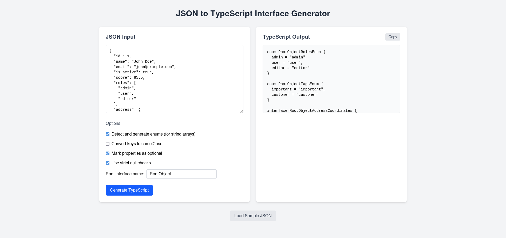

# JSON to TypeScript Interface Generator

A browser-based tool that converts JSON data into TypeScript interfaces with configurable options for type generation.



## Features

- **Intuitive UI**: Clean, responsive interface built with Vue 3 and Tailwind CSS
- **Live Validation**: Real-time JSON validation with helpful error messages
- **Configurable Output**: Multiple options to customize the generated TypeScript
- **Smart Type Detection**: Automatically detects and generates appropriate types
- **Copy to Clipboard**: One-click copy functionality for the generated output

## Configuration Options

- **Enum Detection**: Automatically detect and generate enums for arrays of strings
- **CamelCase Conversion**: Convert property names from snake_case to camelCase
- **Optional Properties**: Mark all properties as optional with the `?` modifier
- **Strict Null Checks**: Include explicit `null` types when null values are detected
- **Custom Root Name**: Set a custom name for the root interface

## Technologies Used

- **Vue 3**: Using the Composition API with script setup syntax
- **TypeScript**: Full TypeScript support for improved type safety
- **Tailwind CSS**: Utility-first CSS framework for styling
- **Vite**: Modern build tool for fast development

## Getting Started

### Prerequisites

- Node.js (v14.0 or higher)
- npm or yarn

### Installation

1. Clone the repository

   ```bash
   git clone https://github.com/yourusername/json-to-typescript.git
   cd json-to-typescript
   ```

2. Install dependencies

   ```bash
   npm install
   # or
   yarn install
   ```

3. Start the development server

   ```bash
   npm run dev
   # or
   yarn dev
   ```

4. Build for production
   ```bash
   npm run build
   # or
   yarn build
   ```

## Usage Example

1. Paste your JSON data into the input area:

   ```json
   {
     "id": 1,
     "user_name": "john_doe",
     "email": "john@example.com",
     "is_active": true,
     "roles": ["admin", "user"]
   }
   ```

2. Configure your options (e.g., enable camelCase conversion)

3. Click "Generate TypeScript"

4. Get your TypeScript interfaces:

   ```typescript
   interface RootObject {
     id?: number;
     userName?: string;
     email?: string;
     isActive?: boolean;
     roles?: RootObjectRolesEnum[];
   }

   enum RootObjectRolesEnum {
     admin = "admin",
     user = "user",
   }
   ```

## Project Structure

```
/
├── public/              # Static assets
├── src/
│   ├── App.vue          # Main app component
│   ├── components/      # Vue components
│   │   └── JsonToTs.vue # Main converter component
│   ├── main.ts          # Application entry point
│   └── utils/           # Utility functions
└── index.html           # HTML template
```

## Contributing

Contributions are welcome! Please feel free to submit a Pull Request.

1. Fork the repository
2. Create your feature branch (`git checkout -b feature/amazing-feature`)
3. Commit your changes (`git commit -m 'Add some amazing feature'`)
4. Push to the branch (`git push origin feature/amazing-feature`)
5. Open a Pull Request

## License

This project is licensed under the MIT License - see the [LICENSE](LICENSE) file for details.

## Acknowledgments

- Inspired by tools like [json2ts](http://www.json2ts.com/) and [quicktype](https://quicktype.io/)
- Built with [Vue 3](https://v3.vuejs.org/) and [Tailwind CSS](https://tailwindcss.com/)
